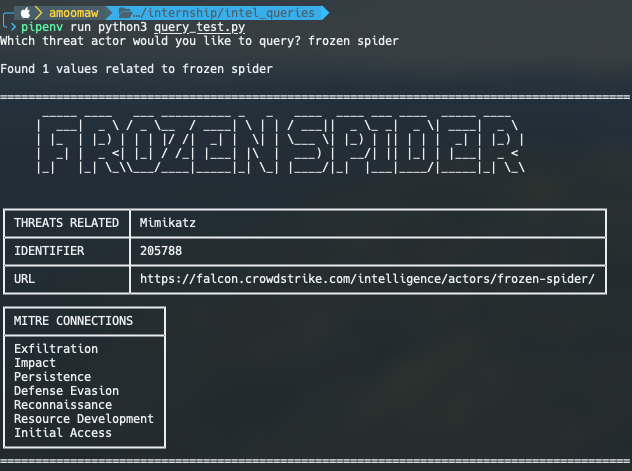

# Falconpy Threat Query

Utilizes The CrowdStrike Falcon SDK to retrieve data about a specific threat actor and information about their attacks.


## Usage

**Install Dependencies**
```
pipenv install tabulate pyfiglet crowdstrike-falconpy
```

**Set API Keys as Environment Variables**
```
echo "export FALCON_CLIENT_ID=acaesfaskcuessneaseiru >> ~/.zshrc"
echo "export FALCON_CLIENT_SECRET=acakelsarusaicanseiaac >> ~/.zshrc"
source ~/.zshrc
```

## Examples


